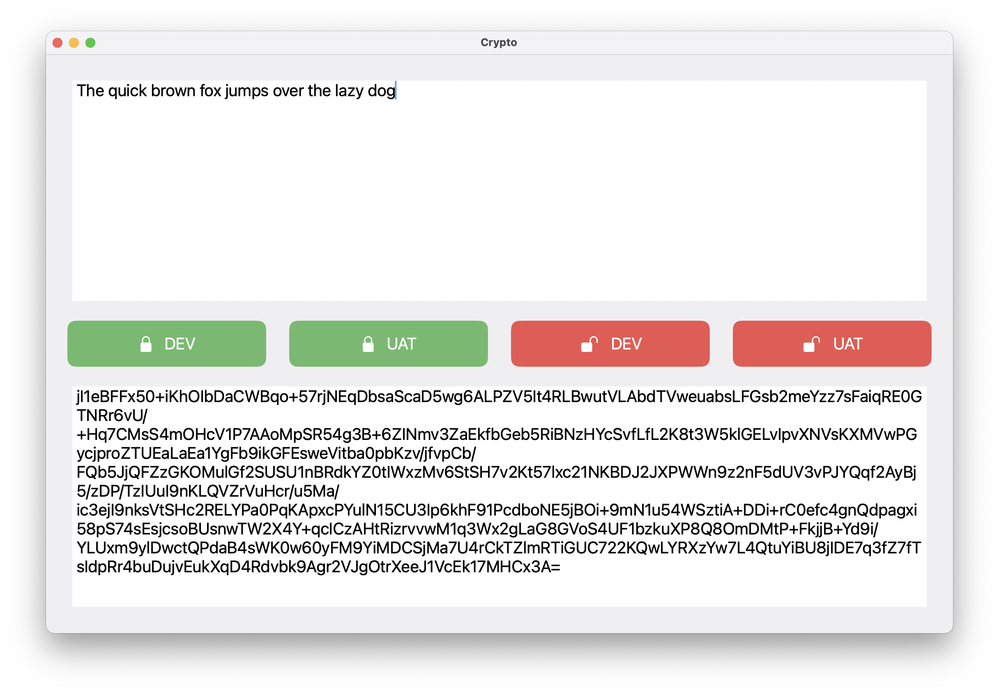

# Crypto

macOS RSA Encryptor is an experimental macOS application that allows users to encrypt and decrypt messages using RSA cryptography. Built with Swift, this project demonstrates secure message encryption and decryption on macOS.

⚠️ Make sure to replace your key in `Constants.swift`

